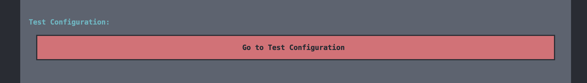

# A17 MotorIST Read Me

## Team

| Number | Name            | User                              | E-mail                                     |
| ------ | --------------- | --------------------------------- | ------------------------------------------ |
| 99309  | Rafael Girão    | https://github.com/rafaelsgirao   | <mailto:rafael.s.girao@tecnico.ulisboa.pt> |
| 102082 | Simão Sanguinho | https://github.com/simaosanguinho | <mailto:simaosanguinho@tecnico.ulisboa.pt> |
| 103252 | José Pereira    | https://github.com/pereira0x      | <mailto:jose.a.pereira@tecnico.ulisboa.pt> |

## Contents

This repository contains documentation and source code for the _Network and Computer Security (SIRS)_ project.

The [REPORT](REPORT.md) document provides a detailed overview of the key technical decisions and various components of the implemented project.
It offers insights into the rationale behind these choices, the project's architecture, and the impact of these decisions on the overall functionality and performance of the system.

This document presents installation and demonstration instructions.

## Installation

To see the project in action, it is necessary to setup a virtual environment, with 5 networks and 6 machines.

The following diagram shows the networks and machines:


### Requirements:

- Nix
- QEMU

### How to run?

1. Open a development shell:

```
nix develop .
```

2. Configure the network interfaces. To do that, you need to run the following command:

```
./infra/networking.sh bootstrap
```

3. Start the VMs. To do that, you need to run the commands bellow in individual terminals.

```
./infra/start_vm.sh manufacturer-db
./infra/start_vm.sh manufacturer-web
./infra/start_vm.sh car1-db
./infra/start_vm.sh car1-web
./infra/start_vm.sh user
./infra/start_vm.sh mechanic
```

4. To run the user and mechanic applications, you need to run the following commands in individual terminals.

```
./use_user.sh <password = SIRS>
> user 1 1

./use_mechanic.sh <password = SIRS>
> mechanic 1
```

Now the VMs should be up and running and you should be able to interact with them.

### How to stop?

There is not a script to stop the VMs, so you need to stop them manually (e.g. we can use the `poweroff` command).

### Prerequisites

All the virtual machines are based on: [NixOS 24.11](https://nixos.org/blog/announcements/2024/nixos-2411/)
The virtual machines are created using [MicroVM](https://github.com/astro/microvm.nix)

### Machine configurations

#### Machine 1 (Car Database)

This machine runs the database service, which is responsible for storing the data of the cars. The database is a PostgreSQL database.

#### Machine 2 (Car Web)

This machine runs the car web server service and the backend, which is responsible for serving the endpoints to the other actors.

#### Machine 3 (Manufacturer Database)

This machine runs the database service, which is responsible for storing the data of the manufacturers. The database is a PostgreSQL database.

#### Machine 4 (Manufacturer Web)

This machine runs the manufacturer web server service, which is responsible for serving firmware to cars and mechanics.

#### Machine 5 (User)

This machine contains the `user` program, used to access the car as a user, and contains all its necessary dependencies. To use this, see `How to` section.

#### Machine 6 (Mechanic)

This machine contains the `mechanic` program, used to access the car as a mechanic, and contains all its necessary dependencies. To use this, see How to section.

## Demonstration

Now that all the networks and machines are up and running, configured after following the installation instructions, we can now demonstrate the MotorIST project under usage scenario with the following actors:

### Car Owner

When the car owner wants to use the application, they first see the home screen.


In this screen they can choose over a variety of options, such as:

- Switch the maintenance mode on or off. For example turning the maintenance mode on, so that the mechanic can perform some tests on the car.


- Check and change the car's battery. The car battery will drain over time, so the car owner can always charge it.


- Check the latests car's firmware version and also the history of all the firmware updates. This will allow the car owner to know if the car is up to date and also check if the firmware is verified, this is, that the car manufacturer was the one who signed the firmware.


- Check the latests mechanic's tests done on the car and also the history of all the tests. This will allow the car owner to know if the car is in good condition and also check if the mechanic performed all the tests.


- Get the current configuration of the car, such as the tire pressure, the air conditioning status, etc.


- Update the car's configuration.


### Mechanic

When the mechanic wants to use the application, they first see the home screen.


In this screen they can choose over a variety of options, such as:

- After specifying the car's id to interact with, the mechanic can update the car's firmware (assuming it is in maintenance mode). This will first ask the manufacturer to issue a new firmware and then the mechanic can apply it to the car.


- After specifying the car's id to interact with, the mechanic can perform tests on the car (assuming it is in maintenance mode). This will allow the mechanic to check if the car is in good condition.


- After specifying the car's id to interact with, the mechanic can update the car's configuration (assuming it is in maintenance mode). This will allow the mechanic to change the car's configuration _only_ for testing purposes. This will not change the user's configuration.




### Manufacturer

The manufacturer can issue a new firmware. Since the manufacturer doesn't have a direct interface with the car and the mechanic, he has available an endpoint to issue a new firmware.


Has we can see in the image above, the manufacturer can issue a new firmware by calling the endpoint `/get-firmware/<car-id>` with the car's id as a parameter. This will return the new firmware version (he uses the unix timestamp as the firmware version) and the signature of the firmware with the manufacturer's private key, so that it can be later verified.

### Car

The car has various endpoints that allow it to interact with the mechanic and the owner. The car can also interact with the manufacturer, but only to get it's first base firmware once it is manufactured.

The endpoints are the ones that were previously mentioned in the Mechanic and Manufacturer sections.

The only endpoint that is not mentioned is the `/set-car-key` endpoint, that allows the car owner to share the car's key (a shared secret that should only be known by the car and the owner) with the car. This is done by calling the endpoint with the car's key, encrypted with the car's public key, as a parameter. This way, the car can decrypt the key and use it to decrypt the configuration updates that the owner sends and retrieves from the car.


It is important to note that the car has a authorization mechanism that only allows actors to interact with certain endpoints if they have the correct permissions (we use the concept of roles here). For example, if we try to interact with the car's configuration without being the owner, we will get the message that we see in the next image. This verification is done by checking the CA certificate that comes from a trusted CA of the person who is calling the endpoint, and checking the role attribute and also the attribute that says which car that actor owns. If the actor doesn't have the correct permissions, the car will not allow the interaction.


Besides this, the car also has a mechanism to verify the firmware that is being sent to it. The same mechanism is used to verify that the mechanic's tests are valid. This is done by checking the signature of the firmware or the tests with the actor's public key. If the signature is valid, the car will accept the firmware or the tests, otherwise it will reject them. We built this mechanism in a robust way, so that we can detect if either the data or the signature was tampered with. For example, if we try to send a firmware with a tampered fields, our mechanism will detect it and reject the firmware.


This concludes the demonstration.

## Additional Information

### Links to Used Tools and Libraries

- [Python](https://www.python.org/)
  - [Flask](https://flask.palletsprojects.com/)
  - [Requests](https://pypi.org/project/requests/)
  - [Cryptography](https://pycryptodome.readthedocs.io/)
  - [Textual](https://textual.textualize.io/)
  - [PsycoPG2](https://www.psycopg.org/)
  - [Werkzeug](https://werkzeug.palletsprojects.com/)
  - [Click](https://click.palletsprojects.com/)
- [NixOS](https://nixos.org/)
- [PostgreSQL](https://www.postgresql.org/)
- [MicroVM](https://github.com/astro/microvm.nix)\]
- [OpenSSL](https://www.openssl.org/)
- [Step](https://smallstep.com/docs/step-ca/)
- [Iputils](https://github.com/iputils/iputils)
- [QEMU](https://www.qemu.org/)
-

### Versioning

We use [Git](https://git-scm.com/) for versioning. For the versions available, see the [tags on this repository](https://github.com/tecnico-sec/A17-MotorIST)

### License

This project is licensed under the MIT License - see the [LICENSE.txt](LICENSE) for details.

______________________________________________________________________

END OF README
