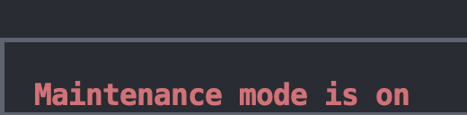

# A17 MotorIST Read Me

## Team

| Number | Name              | User                             | E-mail                              |
| -------|-------------------|----------------------------------| ------------------------------------|
| 99309  | Rafael Girão     | https://github.com/simaosanguinho   | <mailto:rafael.s.girao@tecnico.ulisboa.pt>   |
| 102082  | Simão Sanguinho      | https://github.com/rafaelsgirao    | <mailto:simaosanguinho@tecnico.ulisboa.pt>     |
| 103252  | José Pereira  | https://github.com/pereira0x | <mailto:jose.a.pereira@tecnico.ulisboa.pt> |


  


## Contents

This repository contains documentation and source code for the *Network and Computer Security (SIRS)* project.

The [REPORT](REPORT.md) document provides a detailed overview of the key technical decisions and various components of the implemented project.
It offers insights into the rationale behind these choices, the project's architecture, and the impact of these decisions on the overall functionality and performance of the system.

This document presents installation and demonstration instructions.

*(adapt all of the following to your project, changing to the specific Linux distributions, programming languages, libraries, etc)*

## Installation

To see the project in action, it is necessary to setup a virtual environment, with N networks and M machines.  

The following diagram shows the networks and machines:

*(include a text-based or an image-based diagram)*

### Prerequisites

All the virtual machines are based on: Linux 64-bit, Kali 2023.3  

[Download](https://...link_to_download_installation_media) and [install](https://...link_to_installation_instructions) a virtual machine of Kali Linux 2023.3.  
Clone the base machine to create the other machines.

*(above, replace witch actual links)*

### Machine configurations

For each machine, there is an initialization script with the machine name, with prefix `init-` and suffix `.sh`, that installs all the necessary packages and makes all required configurations in the a clean machine.

Inside each machine, use Git to obtain a copy of all the scripts and code.

```sh
$ git clone https://github.com/tecnico-sec/cxx...
```

*(above, replace with link to actual repository)*

Next we have custom instructions for each machine.

#### Machine 1

This machine runs ...

*(describe what kind of software runs on this machine, e.g. a database server (PostgreSQL 16.1))*

To verify:

```sh
$ setup command
```

*(replace with actual commands)*

To test:

```sh
$ test command
```

*(replace with actual commands)*

The expected results are ...

*(explain what is supposed to happen if all goes well)*

If you receive the following message ... then ...

*(explain how to fix some known problem)*

#### Machine ...

*(similar content structure as Machine 1)*

## Demonstration

Now that all the networks and machines are up and running,configured after following the installation instructions, we can now demonstrate the MotorIST project under usage scenario with the following actors:

### Car Owner

When the car owner wants to use the application, they first see the home screen.


In this screen they can choose over a variety of options, such as:
- Switch the maintenance mode on or off. For example turning the maintenance mode on, so that the mechanic can perform some tests on the car.




- Check and change the car's battery. The car battery will drain over time, so the car owner can always charge it.


- Check the latests car's firmware version and also the history of all the firmware updates. This will allow the car owner to know if the car is up to date and also check if the firmware is verified, this is, that the car manufacturer was the one who signed the firmware.


- Check the latests mechanic's tests done on the car and also the history of all the tests. This will allow the car owner to know if the car is in good condition and also check if the mechanic performed all the tests.


- Get the current configuration of the car, such as the tire pressure, the air conditioning status, etc.


- Update the car's configuration.


### Mechanic

When the mechanic wants to use the application, they first see the home screen.


In this screen they can choose over a variety of options, such as:
- After specifying the car's id to interact with, the mechanic can update the car's firmware (assuming it is in maintenance mode). This will first ask the manufacturer to issue a new firmware and then the mechanic can apply it to the car.


- After specifying the car's id to interact with, the mechanic can perform tests on the car (assuming it is in maintenance mode). This will allow the mechanic to check if the car is in good condition.


- After specifying the car's id to interact with, the mechanic can update the car's configuration (assuming it is in maintenance mode). This will allow the mechanic to change the car's configuration *only* for testing purposes. This will not change the user's configuration.


### Manufacturer

The manufacturer can issue a new firmware. Since the manufacturer doesn't have a direct interface with the car and the mechanic, he has available an endpoint to issue a new firmware.


Has we can see in the image above, the manufacturer can issue a new firmware by calling the endpoint `/get-firmware/<car-id>` with the car's id as a parameter. This will return the new firmware version (he uses the unix timestamp as the firmware version) and the signature of the firmware with the manufacturer's private key, so that it can be later verified.


### Car

The car has various endpoints that allow it to interact with the mechanic and the owner. The car can also interact with the manufacturer, but only to get it's first base firmware once it is manufactured. 

The endpoints are the ones that were previously mentioned in the Mechanic and Manufacturer sections.

The only endpoint that is not mentioned is the `/set-car-key` endpoint, that allows the car owner to share the car's key (a shared secret that should only be known by the car and the owner) with the car. This is done by calling the endpoint with the car's key, encrypted with the car's public key, as a parameter. This way, the car can decrypt the key and use it to decrypt the configuration updates that the owner sends and retrieves from the car.

It is important to note that the car has a authorization mechanism that only actors to interact with certain endpoints if they have the correct permissions (we use the concept of roles here). 


*(give a tour of the best features of the application; add screenshots when relevant)*

```sh
$ demo command
```

*(replace with actual commands)*

*(IMPORTANT: show evidence of the security mechanisms in action; show message payloads, print relevant messages, perform simulated attacks to show the defenses in action, etc.)*

This concludes the demonstration.

## Additional Information

### Links to Used Tools and Libraries

- [Python](https://www.python.org/)
  - [Flask](https://flask.palletsprojects.com/)
  - [Requests](https://pypi.org/project/requests/)
  - [Cryptography](https://pycryptodome.readthedocs.io/)
  - [Textual](https://textual.textualize.io/)
  - [PsycoPG2](https://www.psycopg.org/)
  - [Werkzeug](https://werkzeug.palletsprojects.com/)
  - [Click](https://click.palletsprojects.com/)
- [NixOS](https://nixos.org/)
- [PostgreSQL](https://www.postgresql.org/)
- [MicroVM](https://github.com/astro/microvm.nix)]
- [OpenSSL](https://www.openssl.org/)
- [Step](https://smallstep.com/docs/step-ca/)
- [Iputils](https://github.com/iputils/iputils)
- [QEMU](https://www.qemu.org/)
- 

### Versioning

We use [Git](https://git-scm.com/) for versioning. For the versions available, see the [tags on this repository](https://github.com/tecnico-sec/A17-MotorIST)

### License

This project is licensed under the MIT License - see the [LICENSE.txt](LICENSE) for details.

----
END OF README
